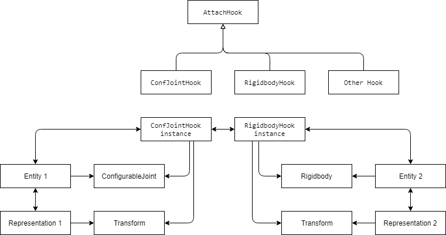

# Using Joint Hooks approach with MVC  pattern with Unity 3D

Because model and representation update speed different, it requires more complex parent child relatons when it is required. The AttachHook class is container for two references:

- Model transform (or rigidbody, joint)
- Representation transform

When hooks connected, each object has acces to model transform or to representation transform.

