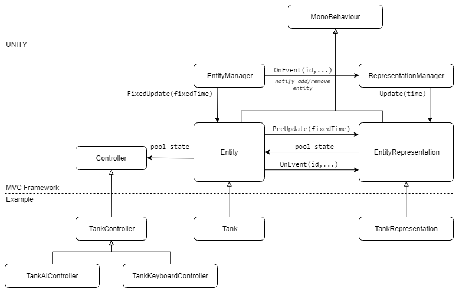

# Using Model-View-Controller pattern with Unity 3D

This repository contains a simple Unity demo project with MVC architecture. The archtecture used in this project based on the articles [[1](https://d1z4o56rleaq4j.cloudfront.net/downloads/assets/Rouwe05_GuerrillaGuideToGameCode.pdf?mtime=20160418102916)] and [[2](http://www.kinematicsoup.com/news/2016/8/9/rrypp5tkubynjwxhxjzd42s3o034o8)]

Figure 1. Framework diagram

## References

[1] [The Guerrilla Guide to Game Code](https://d1z4o56rleaq4j.cloudfront.net/downloads/assets/Rouwe05_GuerrillaGuideToGameCode.pdf?mtime=20160418102916)

[2] [Timesteps and Achieving Smooth Motion in Unity](http://www.kinematicsoup.com/news/2016/8/9/rrypp5tkubynjwxhxjzd42s3o034o8)

[3] [Fix Your Timestep! How to step your physics simulation forward](https://gafferongames.com/post/fix_your_timestep/)

[4] [deWiTTERS Game Loop](http://www.koonsolo.com/news/dewitters-gameloop/)

[5] [Synchronous RTS Engines and a Tale of Desyncs](https://blog.forrestthewoods.com/synchronous-rts-engines-and-a-tale-of-desyncs-9d8c3e48b2be#.kt2uk2a89)

[6] [Unity Documentation: Execution Order of Event Functions](https://docs.unity3d.com/Manual/ExecutionOrder.html)
